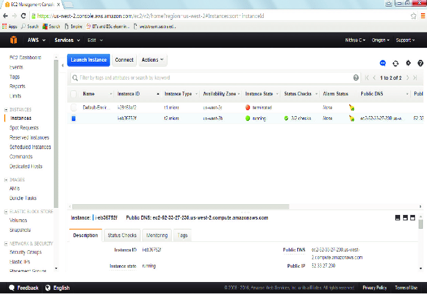
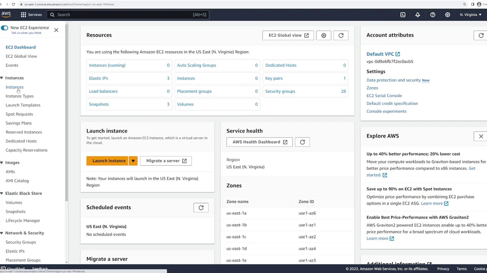

# aws-ec2-desafio

# 🚀 Desafio de Projeto: Gerenciamento de Instâncias EC2 na AWS

Este repositório contém a documentação e os insights adquiridos durante o desafio prático de gerenciamento de instâncias **Amazon EC2 (Elastic Compute Cloud)**, proposto pela Digital Innovation One (DIO).

O objetivo principal foi consolidar a compreensão do **ciclo de vida** de uma máquina virtual na nuvem AWS, desde sua criação até seu encerramento, e documentar o processo de forma clara e estruturada.

---

## 🎯 Objetivos de Aprendizagem

Ao longo da prática e desta documentação, os seguintes conceitos foram consolidados:

* **Lançamento de Instância:** Seleção de **AMI**, tipo de instância e criação de **Key Pair**.
* **Segurança de Rede:** Configuração e importância dos **Grupos de Segurança (Security Groups)**.
* **Conectividade:** Acesso remoto à instância via SSH.
* **Ciclo de Vida:** Entendimento dos estados de uma instância (`Running`, `Stopped`, `Terminated`) e suas implicações em custos e dados.
* **Documentação Técnica:** Uso eficaz do **Markdown** e do **GitHub** para registrar processos técnicos.

---

## 🛠️ Prática Técnica: Configuração da Instância EC2

### 1. Detalhes do Lançamento

A instância foi lançada seguindo a trilha do nível gratuito (Free Tier) para fins de estudo:

| Configuração | Detalhe Aplicado | Observações/Insights |
| :--- | :--- | :--- |
| **AMI (OS)** | `<Nome da AMI que você usou, ex: Ubuntu Server 22.04 LTS>` | Escolhida por sua ampla compatibilidade e familiaridade. |
| **Tipo de Instância** | `<Ex: t2.micro>` | Selecionada para se adequar aos requisitos de custo zero do Free Tier. |
| **Key Pair** | `<Nome da sua chave, ex: chave-dio-ec2>` | **Insight:** O arquivo `.pem` associado é a única credencial de acesso via SSH e deve ser protegido. |
| **Volume Root (EBS)** | `<Ex: 8 GB>` | O armazenamento persistente da instância, que mantém os dados mesmo quando a instância é parada. |

### 2. Grupo de Segurança (Security Group)

Foi criado um Grupo de Segurança chamado **`<Nome do seu Security Group, ex: sg-desafio-web>`** para controlar o tráfego de entrada (Inbound) e saída (Outbound):

| Regra de Entrada | Protocolo/Porta | Origem (Source) | Finalidade |
| :--- | :--- | :--- | :--- |
| **SSH** | TCP / Porta `22` | `<Seu IP ou 0.0.0.0/0>` | Permite a conexão remota para administração da instância. |
| **HTTP** | TCP / Porta `80` | `0.0.0.0/0` | Permite que a instância sirva conteúdo web publicamente. |

**Insight sobre Security Group:** É um **firewall virtual de estado**. Garante que apenas o tráfego essencial (como SSH e HTTP) seja permitido, minimizando a superfície de ataque.

### 3. Conexão SSH

Após a instância estar em estado `Running`, a conexão foi estabelecida via terminal:

```bash
# Comando usado para garantir a permissão correta da chave privada
chmod 400 <nome-da-sua-chave>.pem

# Comando de conexão (substitua o usuário e o IP)
ssh -i <nome-da-sua-chave>.pem <usuario-da-ami>@<IP-Público-da-Instância>
# Ex: ssh -i chave-dio-ec2.pem ubuntu@34.200.100.50


## 🖼️ Evidências Visuais da Prática

Aqui estão as capturas de tela que comprovam o gerenciamento da instância EC2:

### 1. Revisão do Lançamento
Esta imagem mostra a tela de revisão final antes de lançar a instância:



### 2. Status da Instância
Esta imagem mostra o console do EC2 com a instância no estado de execução ou parada:



---
